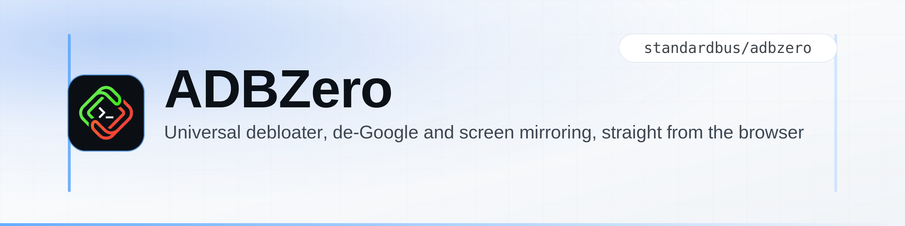
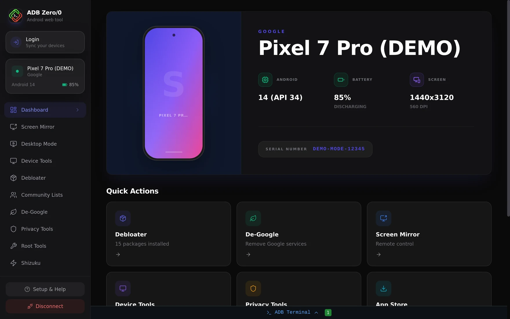
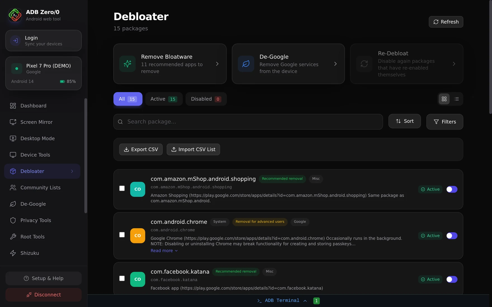
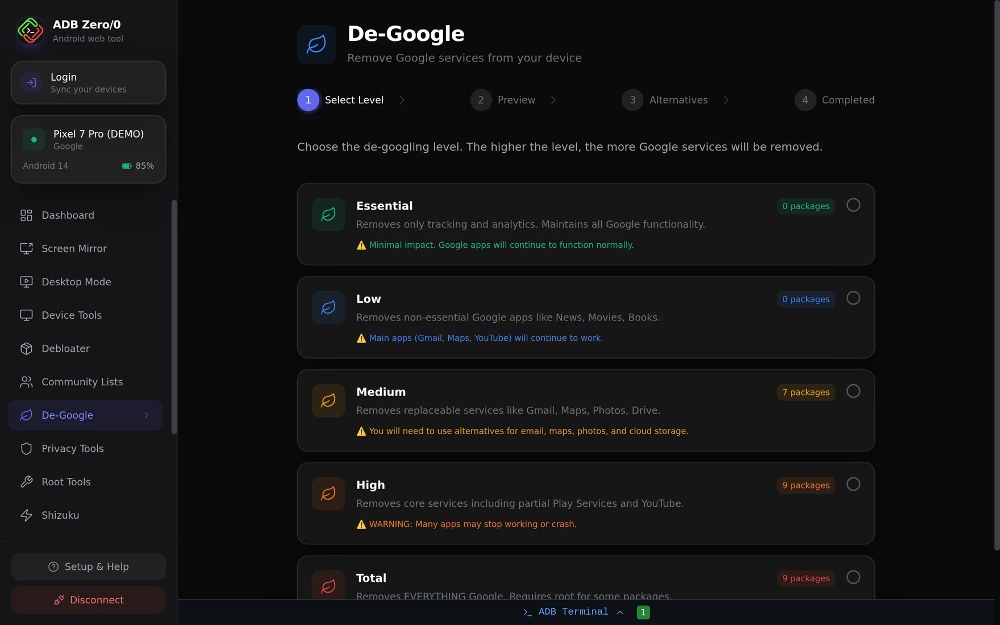
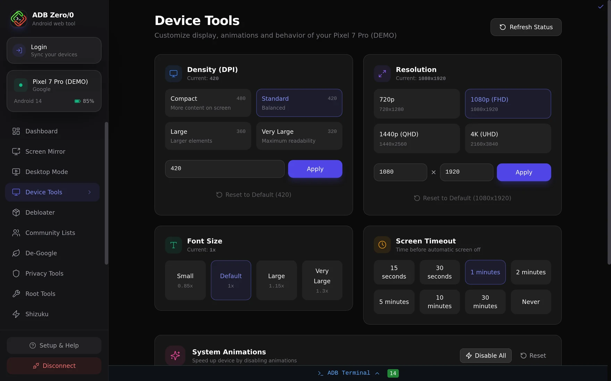
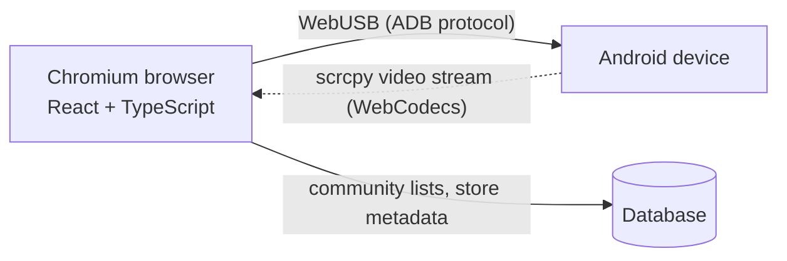

<picture>
  <source media="(prefers-color-scheme: dark)" srcset=".github/assets/hero-dark.png">
  
</picture>

**ADBZero** is a browser-based Android control suite. Debloat, de-Google, mirror the
screen, install APKs and manage files on a real device — directly from Chrome, Edge or
any other Chromium browser. No installer, no drivers, no account.

[adbzero.com](https://adbzero.com) · [Telegram](https://t.me/adbzero) · [Reddit](https://www.reddit.com/r/adbzero/) · [Demo mode](https://adbzero.com/app)

## Why ADBZero

Android already ships everything needed to manage a device — the [Android Debug Bridge](https://developer.android.com/tools/adb).
What was missing is a front end that does not require installing a desktop application, a
USB driver or trusting a third-party binary: ADBZero speaks ADB over **WebUSB** from the
browser tab. Commands run locally, and the built-in terminal shows every one of them.

## Features

| | |
|---|---|
| **Debloater** | Remove system apps and bloatware, with search, filters, CSV import/export and a Re-Debloat pass for packages that re-enable themselves. Community lists let you import what other users are removing. |
| **De-Google** | Five levels — Essential, Low, Medium, High, Total — with a preview of every package before applying and FOSS alternatives (Aurora Store, F-Droid, …) suggested for what gets removed. |
| **Screen Mirroring** | Low-latency mirroring using scrcpy over WebCodecs: taps and input from the browser, adaptive bitrate and screen recording straight to a file. |
| **Desktop Mode** | DeX-style desktop experience driven from the browser. |
| **App Store + APK Installer** | Browse and install open-source apps from F-Droid, or drag and drop your own APKs — including batch installs in one session. |
| **File Manager** | Browse, upload, download, rename, delete, `chmod` and `chown`, in user mode or with root. |
| **App Cloner** | Clone apps through Android's native managed profiles: isolated data, no virtualisation layer, no performance penalty. |
| **Device & Privacy Tools** | DPI, resolution and animation scale, Private DNS (AdGuard, NextDNS, …), ad blocking and other system-wide toggles without root. |
| **Root & Shizuku Tools** | Optional privileged operations for rooted devices, or via [Shizuku](https://github.com/RikkaApps/Shizuku) without rooting. |
| **History** | Every command executed, visible and exportable as a log file. |

## Requirements

| | |
|---|---|
| **Browser** | Any Chromium-based browser with WebUSB: Chrome, Edge, Opera, Brave, Vivaldi, Zen. Firefox and Safari do not implement WebUSB, so they cannot work — that limitation comes from the browser, not from ADBZero. |
| **Device** | Android with USB debugging enabled. Root is optional and only unlocks the privileged tools. |
| **Install** | None. Open the site, connect the cable. |

## Quick start

1. On the phone: **Settings → About phone → tap Build number 7 times**, then
   **Developer options → USB debugging → On**.
2. Connect the phone to the computer with a USB cable.
3. Open **[adbzero.com](https://adbzero.com)** and click **Connect Device**.
4. Accept the debugging prompt that appears on the phone.

No device at hand? **[Demo mode](https://adbzero.com/app)** shows the full interface with
a simulated Pixel 7 Pro.

## Screenshots

<table>
<tr>
<td></td>
<td></td>
</tr>
<tr>
<td align="center">Debloater — recommended removals, filters, CSV lists</td>
<td align="center">De-Google — pick a level, preview every package</td>
</tr>
<tr>
<td></td>
<td></td>
</tr>
<tr>
<td align="center">Device tools — DPI, resolution, Private DNS</td>
<td align="center">Dashboard — device identity and state</td>
</tr>
</table>

*All screenshots are taken from demo mode.*

## Privacy

- **Client-side by design.** The ADB session is created inside your browser through
  WebUSB: device data, commands and RSA keys never leave your machine for a server.
- **Nothing to install, nothing to trust blindly.** The whole tool is this repository —
  the code that talks to your phone is the code you can read here.
- **Full transparency while it runs.** The live terminal shows each command as it is
  executed and lets you export the complete log.

## Under the hood

| Layer | What it uses |
|---|---|
| Device communication | [`@yume-chan/adb`](https://github.com/yume-chan/ya-webadb) over WebUSB, scrcpy protocol for mirroring |
| Front end | React 18, TypeScript, Vite, Tailwind CSS, Zustand, Framer Motion |
| Media | scrcpy stream decoded with WebCodecs |
| Back end | Database (community debloat lists, store metadata, CMS) |
| Delivery | Progressive Web App (`vite-plugin-pwa`) — installable from the browser |

Available in **13 languages**: Arabic, Bengali, German, English, Spanish, French, Hindi,
Indonesian, Italian, Japanese, Portuguese (Brazil), Russian, Chinese.

## Contributing

Bug reports and feature requests are welcome in [Issues](../../issues). For debloat
lists, app reports and general discussion, join
[**r/adbzero**](https://www.reddit.com/r/adbzero/) or the
[Telegram group](https://t.me/adbzero) and share what works on your device — the
community lists are the practical part of this project.

## License

Released under the [MIT license](LICENSE).

*Android Debloater, Web ADB, Screen Mirroring in the browser, De-Google Android,
Android privacy tool, ADB web terminal, F-Droid browser client.*

ADBZero is an independent project, not affiliated with Google LLC. Android is a trademark of Google LLC.

